# Bhogyaan NR — GitHub Profile

  

## About Me

Frontend Software Engineer with 1+ year of experience building scalable, high-performance web applications using React.js, Next.js, Redux, and the MERN stack.

- 🚀 Improved page load speed by up to **4x** through frontend performance optimization.
- 👨‍💻 Mentor and guide a team of **4 interns/developers**.
- 🧩 Build reusable UI components and frontend utilities.
- 🔐 Work with REST APIs, authentication, authorization, and full-stack MERN workflows.
- 🎨 Build responsive interfaces with React, Redux and GSAP.
- ☁️ Deploy applications using Vercel, Netlify and Render.

## Tech Stack

**Frontend:** HTML, CSS, JavaScript, React.js, Next.js, Redux, Tailwind CSS, GSAP

**Backend:** Node.js, Express.js, Fastify.js

**Databases:** MongoDB, MySQL

**Deployment:** Vercel, Render, Netlify

**Tools:** VS Code, Git, MS Office, Postman

## Experience

### Associate Software Engineer — Success Life Mantra
**Madurai, Tamil Nadu · Jul 2025 – Present**

- Mentor and guide a team of 4 interns/developers.
- Optimize Redux state management and inefficient components.
- Deliver user management, authentication, authorization, dashboards and workflow modules.
- Build responsive React.js/Redux interfaces with GSAP animations.
- Maintain reusable UI components and shared frontend utilities.
- Integrate secure RESTful APIs and authentication flows.
- Support cross-browser and responsive application delivery.
- Deploy and maintain staging and production applications.

## Featured Projects

### Childcare Business Website with Custom CMS
**React.js · Node.js · Express · MongoDB**

Business website with a custom CMS allowing non-technical staff to manage content, assets, page sections and events.

### Resume Builder with Live Editor
**React.js · JavaScript · Tailwind CSS**

Interactive resume builder with live preview, editable sections and a component-driven architecture designed for multiple templates and layouts.

### Real-Time Blog Web Application
**MERN · JWT · WebSockets**

Full-stack blogging platform with authentication, real-time updates and an interactive content creation experience.

## Education

- **MCA — K.L.N College of Engineering, Sivaganga** — CGPA: 8.3
- **B.Sc Computer Science — KLN Arts and Science College, Sivaganga** — CGPA: 7.9

## Certifications

- Web Development — Udemy
- React.js Workshop
- Power BI Workshop
- MERN Stack Workshop

## Languages & Soft Skills

**Languages:** English, Tamil, Saurashtra

**Soft Skills:** Communication, Team Collaboration, Problem-Solving, Adaptability

## Connect

- 📧 [Email](mailto:nrbhogyaan@gmail.com)
- 💼 [LinkedIn](https://linkedin.com/in/bhogyaannr)
- 🌐 [Portfolio](https://bhogyaan.vercel.app/)
- 💻 [GitHub](https://github.com/Bhogyaan)
