 

  

  

---

## ✦ About me

I'm a **Frontend Software Engineer** at **Success Life Mantra**, focused on building responsive, maintainable and performance-oriented web applications.

I turn product requirements into polished interfaces, reusable components and reliable production features. My work spans frontend architecture, API integration, authentication, browser extensions and CI/CD delivery.

> **Clean interfaces · thoughtful architecture · measurable performance**

## ⚡ What I do

<table>
<tr>
<td width="50%">

### Frontend engineering

Component-driven applications with **React, Next.js, Redux and JavaScript**.

</td>
<td width="50%">

### UI and interaction

Responsive interfaces with **Tailwind CSS, GSAP** and accessible design patterns.

</td>
</tr>
<tr>
<td width="50%">

### Performance

State optimization, component refactoring and faster user experiences.

</td>
<td width="50%">

### Product delivery

REST APIs, authentication, GitHub Actions and cloud deployment.

</td>
</tr>
</table>

## 🧰 Technology stack

  

## 💼 Experience

### Associate Software Engineer · Success Life Mantra
**Madurai, Tamil Nadu · Jul 2025 — Present**

- Mentor and guide a team of interns and developers.
- Review code, resolve bugs and improve release stability.
- Build reusable UI components, shared utilities and product modules.
- Develop user management, authentication, authorization, dashboards and workflow automation features.
- Optimize Redux state management and component architecture for applications serving up to 1,000 users.
- Build and publish Chrome browser extensions from development through store approval.
- Set up automated testing and deployment pipelines with GitHub Actions.

## 🚀 Selected projects

<table>
<tr>
<td width="33%" valign="top">

### Childcare CMS

**React · Node.js · Express · MongoDB**

A custom CMS that helps non-technical teams manage pages, assets, events and content with real-time publishing.

</td>
<td width="33%" valign="top">

### Resume Builder

**React · JavaScript · Tailwind CSS**

An interactive resume editor with live preview, editable sections, reusable components and flexible templates.

</td>
<td width="33%" valign="top">

### Real-time Blog

**MERN · JWT · WebSocket**

A full-stack publishing platform focused on real-time content, authentication and reader interaction.

</td>
</tr>
</table>

## 🔁 How I build

1. Understand the user, product and technical constraints.
2. Design simple architecture with reusable boundaries.
3. Implement accessible, responsive and maintainable UI.
4. Measure the experience and remove unnecessary complexity.
5. Ship, observe and improve continuously.

## 🎓 Education

- **Master of Computer Applications** — K.L.N College of Engineering, Sivaganga · **2025 · CGPA 8.3**
- **B.Sc. Computer Science** — KLN Arts and Science College, Sivaganga · **2022 · CGPA 7.9**

## 📜 Certifications and workshops

`Web Development` · `React.js` · `Power BI` · `MERN Stack`

## 📊 GitHub activity

  

  

## 🤝 Let’s build something meaningful

Whether it is a new product, a frontend challenge or an interesting engineering problem, I'm always open to building.

  

