<!--
  ╔══════════════════════════════════════════════════════════════════════════════╗
  ║  N R BHOGYAAN — MOTION-DESIGNED GITHUB PROFILE                               ║
  ║  2026 · Glassmorphism · Neon · Cyberpunk · Animated · Luxury SaaS Aesthetic  ║
  ║  Inspired by: Apple · Vercel · Linear · Framer · Stripe · Arc · Raycast      ║
  ╚══════════════════════════════════════════════════════════════════════════════╝
-->

<!-- ════════════════════════════════════════════════════════════
     ANIMATED HERO BANNER (cyber grid + particles + neon line)
     ════════════════════════════════════════════════════════════ -->
<div align="center">
  
</div>


<!-- ════════════════════════════════════════════════════════════
     TYPING ANIMATION — rotating neon taglines
     ════════════════════════════════════════════════════════════ -->
<div align="center">
  
</div>

<br/>

<!-- Sparkles divider -->
<div align="center">
  
</div>

<!-- ════════════════════════════════════════════════════════════
     PREMIUM CODING GIF STRIP
     ════════════════════════════════════════════════════════════ -->
<div align="center">
  
  &nbsp;
  
</div>

<br/>

<!-- Animated wave divider -->
<div align="center">
  
</div>

<br/>

<!-- ════════════════════════════════════════════════════════════
     SOCIAL + LIVE BADGES DASHBOARD
     ════════════════════════════════════════════════════════════ -->
<p align="center">
  <a href="https://github.com/Bhogyaan"></a>
  <a href="https://bhogyaan.vercel.app"></a>
  <a href="https://linkedin.com/in/bhogyaannr"></a>
  <a href="mailto:bhogyaannr@gmail.com"></a>
  <a href="https://leetcode.com/u/Bhogyaan"></a>
</p>
<p align="center">
  <a href="https://bhogyaan.vercel.app"></a>
  <a href="https://twitter.com/"></a>
  <a href="https://dev.to/"></a>
  <a href="https://medium.com/"></a>
</p>
<p align="center">
  
  
  
  
</p>

<br/>

<!-- ════════════════════════════════════════════════════════════
     GLASS PROFILE CARD + GLOW RING
     ════════════════════════════════════════════════════════════ -->
<div align="center">
  
</div>

<div align="center">
  <table>
    <tr>
      <td align="center" width="900" bgcolor="#161B22">
        <br/>
        
        <br/>
        
        <br/><br/>
        <h2>N R Bhogyaan</h2>
        <p>
          <strong>Frontend Software Engineer</strong>
          &nbsp;·&nbsp; <code>React</code> <code>Next.js</code> <code>TypeScript</code> <code>MERN</code>
        </p>
        <p>
          📍 <strong>Madurai, Tamil Nadu, India</strong>
          &nbsp;|&nbsp; 🏢 <strong>Success Life Mantra</strong>
          &nbsp;|&nbsp; 🟢 <strong>Open to Opportunities</strong>
        </p>
        <p>
          Building production apps · Mentoring juniors · Animation & performance focused
        </p>
        <br/>
      </td>
    </tr>
  </table>
</div>

<div align="center">
  
</div>

<br/>

<!-- Wave -->
<div align="center">
  
</div>

<br/>

<!-- ════════════════════════════════════════════════════════════
     LIVE STATUS DASHBOARD
     ════════════════════════════════════════════════════════════ -->
<div align="center">
  <h3>📡 Live Status Dashboard</h3>
  
</div>

<div align="center">
  <table>
    <tr>
      <td align="center" width="150" bgcolor="#161B22">
        <br/><strong>🎯 Focus</strong><br/>
        <br/><br/>
      </td>
      <td align="center" width="150" bgcolor="#161B22">
        <br/><strong>📚 Learning</strong><br/>
        <br/><br/>
      </td>
      <td align="center" width="150" bgcolor="#161B22">
        <br/><strong>☕ Fuel</strong><br/>
        <br/><br/>
      </td>
      <td align="center" width="150" bgcolor="#161B22">
        <br/><strong>🌍 Base</strong><br/>
        <br/><br/>
      </td>
      <td align="center" width="150" bgcolor="#161B22">
        <br/><strong>💬 Status</strong><br/>
        <br/><br/>
      </td>
    </tr>
  </table>
</div>

<br/>

<!-- ════════════════════════════════════════════════════════════
     ANIMATED TERMINAL — ABOUT ME
     ════════════════════════════════════════════════════════════ -->
<div align="center">
  <h3>💻 Terminal</h3>
  
</div>

<div align="center">
<table width="900">
<tr>
<td bgcolor="#0D1117">

```bash
bhogyaan@dev:~$ whoami
N R Bhogyaan

bhogyaan@dev:~$ company
Success Life Mantra · Madurai, Tamil Nadu, India

bhogyaan@dev:~$ role
Frontend Software Engineer · Associate

bhogyaan@dev:~$ stack --primary
React · Next.js · Redux · TypeScript · Node.js · Express · MongoDB · MySQL

bhogyaan@dev:~$ learning
Next.js · AWS · System Design · GSAP · Three.js · Advanced TypeScript

bhogyaan@dev:~$ impact
⚡  4× page-load improvement on production app
👥  Mentoring 4 junior developers
📦  Shipped core modules serving 1,000+ active users
🎨  GSAP-driven UI animations & micro-interactions

bhogyaan@dev:~$ hobbies
UI Design · Performance · Animations · Open Source · Creative Coding

bhogyaan@dev:~$ status
● available for opportunities _
```

</td>
</tr>
</table>
</div>

<br/>

<div align="center">
  
</div>

<br/>

<!-- ════════════════════════════════════════════════════════════
     EXPERIENCE TIMELINE — glass cards + glow markers
     ════════════════════════════════════════════════════════════ -->
<div align="center">
  <h3>🧭 Professional Timeline</h3>
  
</div>

<br/>

<table width="100%">
  <tr>
    <td width="32" align="center" valign="top">
      
    </td>
    <td>
      <table width="100%"><tr><td bgcolor="#161B22">
        <br/>
        &nbsp;&nbsp;
        &nbsp;&nbsp;<strong>Associate Software Engineer</strong> @ <strong>Success Life Mantra</strong>
        <br/><br/>
        &nbsp;&nbsp;⚡ 4× page-load boost on production applications<br/>
        &nbsp;&nbsp;👥 Mentoring 4 junior developers<br/>
        &nbsp;&nbsp;📦 Core modules for 1,000+ active users<br/>
        &nbsp;&nbsp;🎨 GSAP-driven UI & micro-interactions<br/>
        &nbsp;&nbsp;<code>React</code> <code>Next.js</code> <code>TypeScript</code> <code>Node</code> <code>MongoDB</code>
        <br/><br/>
      </td></tr></table>
    </td>
  </tr>
  <tr>
    <td width="32" align="center" valign="top">
      
    </td>
    <td>
      <table width="100%"><tr><td bgcolor="#161B22">
        <br/>
        &nbsp;&nbsp;
        &nbsp;&nbsp;<strong>MCA, Computer Applications</strong> — KLN College of Engineering
        <br/><br/>
        &nbsp;&nbsp;📊 CGPA <strong>8.3</strong> · Full-stack & System Design foundations
        <br/><br/>
      </td></tr></table>
    </td>
  </tr>
  <tr>
    <td width="32" align="center" valign="top">
      
    </td>
    <td>
      <table width="100%"><tr><td bgcolor="#161B22">
        <br/>
        &nbsp;&nbsp;
        &nbsp;&nbsp;<strong>B.Sc. Computer Science</strong> — KLN Arts & Science College
        <br/><br/>
        &nbsp;&nbsp;📊 CGPA <strong>7.9</strong> · Algorithms, DS & core CS
        <br/><br/>
      </td></tr></table>
    </td>
  </tr>
</table>

<br/>

<div align="center">
  
</div>

<br/>

<!-- ════════════════════════════════════════════════════════════
     TECH STACK DASHBOARD + FLOATING ICONS
     ════════════════════════════════════════════════════════════ -->
<div align="center">
  <h3>🛠️ Tech Stack Dashboard</h3>
  
</div>

<br/>

<div align="center">
  <strong>Frontend</strong><br/>
  
  <br/><br/>
  <strong>Backend</strong><br/>
  
  <br/><br/>
  <strong>Database</strong><br/>
  
  <br/><br/>
  <strong>Cloud & Deploy</strong><br/>
  
  <br/><br/>
  <strong>Tools & Design</strong><br/>
  
  <br/><br/>
  <strong>Creative</strong><br/>
  
</div>

<br/>

<!-- Skill bars -->
<div align="center">
  <h3>📊 Skill Proficiency</h3>
</div>

<div align="center">
<table width="680">
  <tr><td width="130"><strong>React</strong></td><td></td></tr>
  <tr><td><strong>Next.js</strong></td><td></td></tr>
  <tr><td><strong>JavaScript</strong></td><td></td></tr>
  <tr><td><strong>TypeScript</strong></td><td></td></tr>
  <tr><td><strong>Node.js</strong></td><td></td></tr>
  <tr><td><strong>MongoDB</strong></td><td></td></tr>
  <tr><td><strong>UI Design</strong></td><td></td></tr>
</table>
</div>

<br/>

<div align="center">
  
</div>

<br/>

<!-- ════════════════════════════════════════════════════════════
     FEATURED PROJECTS — premium glass cards
     ════════════════════════════════════════════════════════════ -->
<div align="center">
  <h3>🚀 Featured Projects</h3>
  
</div>

<br/>

<table width="100%">
  <tr>
    <td width="50%" valign="top">
      <table width="100%"><tr><td bgcolor="#161B22">
        <br/>
        &nbsp;&nbsp;
        &nbsp;&nbsp;<strong>CareerPro AI</strong>
        <br/><br/>
        &nbsp;&nbsp;AI-assisted resume & career tooling with live editing<br/>
        &nbsp;&nbsp;and one-click export.
        <br/><br/>
        &nbsp;&nbsp;<code>React</code> <code>Node</code> <code>MongoDB</code> <code>OpenAI</code>
        <br/><br/>
        &nbsp;&nbsp;<a href="https://github.com/Bhogyaan"></a>
        &nbsp;<a href="https://bhogyaan.vercel.app"></a>
        <br/><br/>
      </td></tr></table>
    </td>
    <td width="50%" valign="top">
      <table width="100%"><tr><td bgcolor="#161B22">
        <br/>
        &nbsp;&nbsp;
        &nbsp;&nbsp;<strong>ETradeHub</strong>
        <br/><br/>
        &nbsp;&nbsp;Full-stack trading / e-commerce with JWT auth<br/>
        &nbsp;&nbsp;and real-time inventory.
        <br/><br/>
        &nbsp;&nbsp;<code>MERN</code> <code>JWT</code> <code>REST</code> <code>Redux</code>
        <br/><br/>
        &nbsp;&nbsp;<a href="https://github.com/Bhogyaan"></a>
        &nbsp;<a href="https://bhogyaan.vercel.app"></a>
        <br/><br/>
      </td></tr></table>
    </td>
  </tr>
  <tr>
    <td width="50%" valign="top">
      <table width="100%"><tr><td bgcolor="#161B22">
        <br/>
        &nbsp;&nbsp;
        &nbsp;&nbsp;<strong>Chrome Extension</strong>
        <br/><br/>
        &nbsp;&nbsp;Productivity extension for daily developer<br/>
        &nbsp;&nbsp;workflows (Manifest V3).
        <br/><br/>
        &nbsp;&nbsp;<code>JavaScript</code> <code>Chrome APIs</code>
        <br/><br/>
        &nbsp;&nbsp;<a href="https://github.com/Bhogyaan"></a>
        <br/><br/>
      </td></tr></table>
    </td>
    <td width="50%" valign="top">
      <table width="100%"><tr><td bgcolor="#161B22">
        <br/>
        &nbsp;&nbsp;
        &nbsp;&nbsp;<strong>Portfolio Website</strong>
        <br/><br/>
        &nbsp;&nbsp;Personal site with modern motion,<br/>
        &nbsp;&nbsp;project showcases & contact flows.
        <br/><br/>
        &nbsp;&nbsp;<code>Next.js</code> <code>Tailwind</code> <code>Framer Motion</code>
        <br/><br/>
        &nbsp;&nbsp;<a href="https://github.com/Bhogyaan"></a>
        &nbsp;<a href="https://bhogyaan.vercel.app"></a>
        <br/><br/>
      </td></tr></table>
    </td>
  </tr>
</table>

<br/>

<div align="center">
  <a href="https://bhogyaan.vercel.app">
    
  </a>
</div>

<br/>

<div align="center">
  
</div>

<br/>

<!-- ════════════════════════════════════════════════════════════
     GITHUB ANALYTICS DASHBOARD
     ════════════════════════════════════════════════════════════ -->
<div align="center">
  <h3>📊 GitHub Analytics</h3>
  
</div>

<br/>

<div align="center">
  
  
</div>

<br/>

<div align="center">
  
</div>

<br/>

<div align="center">
  
</div>

<br/>

<div align="center">
  
</div>

<br/>

<div align="center">
  
</div>

<br/>

<!-- ════════════════════════════════════════════════════════════
     SNAKE + PACMAN + 3D GRAPH
     ════════════════════════════════════════════════════════════ -->
<div align="center">
  <h3>🐍 Contribution Snake</h3>
  
  <br/><sub>Auto-generated · <code>snake.yml</code></sub>
</div>

<br/>

<div align="center">
  <h3>👾 Pac-Man Graph</h3>
  
  <br/><sub>Auto-generated · <code>pacman.yml</code></sub>
</div>

<br/>

<div align="center">
  <h3>🧊 Activity Graph</h3>
  
</div>

<br/>

<div align="center">
  
</div>

<br/>

<!-- ════════════════════════════════════════════════════════════
     QUOTE + VISITORS + CONNECT
     ════════════════════════════════════════════════════════════ -->
<div align="center">
  <h3>💬 Developer Quote</h3>
  
</div>

<br/>

<div align="center">
  <h3>👁️ Visitors</h3>
  
  &nbsp;
  
</div>

<br/>

<div align="center">
  <h3>🤝 Let's Connect</h3>
  <p>Open to freelance · full-time · open-source · mentorship</p>
  <a href="mailto:bhogyaannr@gmail.com"></a>
  <a href="https://linkedin.com/in/bhogyaannr"></a>
  <a href="https://bhogyaan.vercel.app"></a>
</div>

<br/>

<!-- ════════════════════════════════════════════════════════════
     ANIMATED FOOTER
     ════════════════════════════════════════════════════════════ -->
<div align="center">
  
</div>

<!-- Capsule footer fallback -->
<div align="center">
  
</div>


