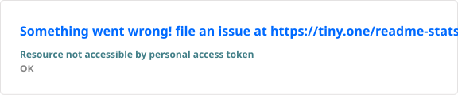

 

  

&nbsp;

&nbsp;

&nbsp;

  

&nbsp;

&nbsp;

  

  

 

---

 

## About

I'm a **Frontend Software Engineer** with **1+ year of professional experience** building scalable and performance-focused web applications.

My primary focus is modern frontend engineering with:

**React.js · Next.js · Redux · JavaScript · Tailwind CSS · GSAP**

I enjoy transforming requirements into:

`Responsive Interfaces` · `Reusable Components` · `Optimized Applications` · `Production Features`

My experience also extends across:

`REST APIs` · `Authentication` · `Browser Extensions` · `CI/CD` · `Deployment`

 

  

**Madurai, Tamil Nadu**

 

---

 

## What I Do

 

### ⚛️ Frontend Engineering

Build modern component-driven applications with a strong focus on architecture, maintainability and responsive experiences.

`React.js` · `Next.js` · `Redux` · `JavaScript`

 

 

### ⚡ Performance Engineering

I focus on making applications feel fast as well as function correctly.

`State Optimization` · `Component Refactoring` · `Page Performance`

 

 

### 🎨 Interactive Experiences

Create polished interfaces with meaningful motion and responsive layouts.

`Tailwind CSS` · `GSAP` · `Responsive UI` · `Cross-browser UI`

 

 

### 🚀 Product Delivery

Work beyond the interface — from API integration to automated deployment.

`REST APIs` · `Authentication` · `GitHub Actions` · `Vercel` · `Netlify` · `Render`

 

 

---

 

## Frontend

  

 

## Backend & Data

  

 

## DevOps & Tools

  

 

---

 

# Associate Software Engineer

**Success Life Mantra · Madurai, Tamil Nadu**

`Jul 2025 → Present`

 

 

### Engineering

- Mentor and guide a team of **4 interns/developers**
- Review code and resolve reported bugs
- Maintain code quality and release stability
- Create reusable UI components and shared frontend utilities
- Reduce duplicate implementation and improve feature delivery

 

### Performance

 

Optimized Redux state management and refactored inefficient components
to improve application performance for a growing user base of
**up to 1,000 users**.

 

### Product Engineering

Built core product modules including:

`USER MANAGEMENT`  
`AUTHENTICATION`  
`AUTHORIZATION`  
`DASHBOARDS`  
`WORKFLOW AUTOMATION`

using **React.js, Redux and RESTful APIs**.

 

### Browser Extension

Developed and published a **Chrome browser extension from scratch**, covering development, build configuration, store submission and approval.

 

### CI/CD & Deployment

Set up **GitHub Actions CI/CD pipelines** for automated testing and deployment.

`Vercel` · `Netlify` · `Render`

 

---

 

# Childcare CMS

### `React.js` · `Node.js` · `Express` · `MongoDB`

A complete business website paired with a custom CMS that allows non-technical staff to independently manage website content.

 

**Core capabilities**

`Content Management` · `Asset Management` · `Image & Text Updates` · `Page Sections` · `Events` · `Real-time Publishing`

 

  

---

# Resume Builder

### `React.js` · `JavaScript` · `Tailwind CSS`

Interactive resume-building application with a live editor and real-time preview.

 

**Core capabilities**

`Live Editing` · `Instant Preview` · `Editable Sections` · `Component Architecture` · `Extendable Templates` · `Flexible Layouts`

 

  

---

# Real-time Blog

### `MERN Stack`

Full-stack blogging platform designed around real-time content and interaction.

 

**Core capabilities**

`React` · `Node.js` · `Express` · `MongoDB` · `JWT` · `WebSocket` · `Interactive Publishing`

 

 

---

  

  

> **Clean code. Thoughtful interfaces. Better performance.**

 

---

  

  

 

---

 

# Master of Computer Applications

**K.L.N College of Engineering · Sivaganga**

`2025` · **CGPA 8.3**

 

  

---

# B.Sc Computer Science

**KLN Arts and Science College · Sivaganga**

`2022` · **CGPA 7.9**

 

 

---

  

&nbsp;

&nbsp;

&nbsp;

  

 

---

 

### 🌐 Browser Extensions

Chrome extension development from concept through store publication.

 

### 🔌 API Integration

REST APIs, authentication workflows and frontend-backend communication.

 

### 📱 Cross-device Experiences

Responsive and cross-browser-compatible web experiences.

 

 

---

  

  

<!-- LOCAL GITHUB STAT -->
<!-- Keep these files inside the repository public/ directory. -->

  

  

 

---

  

  

 

---

  

&nbsp;

&nbsp;

  

**Communication** · **Team Collaboration** · **Problem-Solving** · **Adaptability**

  

 

---

  

Whether it's a new product, a frontend challenge,
or an interesting engineering problem —

**I'm always open to building.**

  

&nbsp;

  

&nbsp;

  

  

