<!--
╭──────────────────────────────────────────────────────────────────────────────╮
│ N R BHOGYAAN                                                                  │
│ Frontend Engineer · UI/UX · Motion · Performance                              │
│                                                                              │
│ Design-first interfaces. Production-ready engineering.                       │
╰──────────────────────────────────────────────────────────────────────────────╯
-->

<!-- ═══════════════════════════════════════════════════════════════════════════
     HERO
     ═══════════════════════════════════════════════════════════════════════════ -->

 

  

  

&nbsp;

&nbsp;

 

<!-- ═══════════════════════════════════════════════════════════════════════════
     POSITIONING
     ═══════════════════════════════════════════════════════════════════════════ -->

## `BUILD` → `DESIGN` → `SHIP`

**Frontend Software Engineer** focused on creating interfaces that are
**fast, intuitive, responsive, accessible, and visually memorable.**

I enjoy working where **engineering meets UI/UX** — turning product ideas into polished
experiences with thoughtful interactions, reusable components, and performance in mind.

 

<!-- ═══════════════════════════════════════════════════════════════════════════
     QUICK SIGNALS
     ═══════════════════════════════════════════════════════════════════════════ -->

<table width="100%">
<tr>

<td align="center" width="25%">

### ⚡ 4×

**Page-load improvement**

</td>

<td align="center" width="25%">

### 👥 4

**Developers mentored**

</td>

<td align="center" width="25%">

### 📦 1K+

**Active users supported**

</td>

<td align="center" width="25%">

### 🎨 UI

**Motion & interaction focused**

</td>

</tr>
</table>

 

<!-- ═══════════════════════════════════════════════════════════════════════════
     CURRENTLY
     ═══════════════════════════════════════════════════════════════════════════ -->

### ✦ CURRENTLY BUILDING

`Production Applications`   `Reusable UI`   `Better Performance`   `Micro-interactions`

### ✦ CURRENTLY EXPLORING

`Next.js`   `AWS`   `System Design`   `GSAP`   `Three.js`   `Advanced TypeScript`

 

<!-- ═══════════════════════════════════════════════════════════════════════════
     EXPERIENCE
     ═══════════════════════════════════════════════════════════════════════════ -->

## 💼 Experience

<table width="100%">
<tr>
<td width="80">

**2025**
**→**

</td>

<td>

### Associate Software Engineer

**Success Life Mantra**

`React` `Next.js` `TypeScript` `Redux` `Node.js` `MongoDB`

* Improved production page-load performance by **up to 4×** through Redux optimization and component refactoring.
* Mentor and guide a team of **4 interns/developers**, including code reviews and bug resolution.
* Delivered core modules including **user management, authentication, authorization, dashboards, and workflows** supporting up to **1,000+ users**.
* Work across frontend engineering, UI implementation, performance optimization, and interactive experiences.

</td>
</tr>
</table>

 

## 🎓 Education

<table width="100%">
<tr>
<td width="50%">

### MCA — Computer Applications

**KLN College of Engineering**

`2023 — 2025`

**CGPA: 8.3**

Full-stack & system design foundations.

</td>

<td width="50%">

### B.Sc. — Computer Science

**KLN Arts & Science College**

`2019 — 2022`

**CGPA: 7.9**

Algorithms, data structures & core CS.

</td>
</tr>
</table>

 

<!-- ═══════════════════════════════════════════════════════════════════════════
     DESIGN / ENGINEERING PHILOSOPHY
     ═══════════════════════════════════════════════════════════════════════════ -->

## 🎯 My Frontend Philosophy

<table width="100%">
<tr>

<td width="33%" align="center">

### 01 · EXPERIENCE

**Design with purpose**

Interfaces should feel clear before
they feel impressive.

</td>

<td width="33%" align="center">

### 02 · ENGINEERING

**Build with structure**

Reusable components, maintainable
architecture & clean state management.

</td>

<td width="33%" align="center">

### 03 · MOTION

**Animate with intention**

Motion should communicate hierarchy,
feedback and interaction—not distraction.

</td>

</tr>
</table>

 

<!-- ═══════════════════════════════════════════════════════════════════════════
     TECH STACK
     ═══════════════════════════════════════════════════════════════════════════ -->

## 🧰 Toolkit

  

  

  

 

<!-- ═══════════════════════════════════════════════════════════════════════════
     PROJECTS
     ═══════════════════════════════════════════════════════════════════════════ -->

## 🚀 Selected Work

*Projects where engineering, product thinking and interface design meet.*

<table width="100%">

<tr>

<td width="50%" valign="top">

### ✦ CareerPro AI

**AI-assisted career & resume platform**

Live editing and one-click export focused on creating a smoother career-tool workflow.

`React` `Node.js` `MongoDB` `OpenAI`

 

</td>

<td width="50%" valign="top">

### ✦ ETradeHub

**Full-stack trading / e-commerce platform**

Authentication, inventory workflows and application state built around a MERN architecture.

`MERN` `JWT` `REST` `Redux`

 

</td>

</tr>

<tr>

<td width="50%" valign="top">

### ✦ Chrome Extension

**Developer productivity workflow**

A Manifest V3 extension built around everyday developer workflows and browser capabilities.

`JavaScript` `Chrome APIs` `Manifest V3`

 

</td>

<td width="50%" valign="top">

### ✦ Portfolio Experience

**Personal portfolio & interaction playground**

A space for showcasing projects, experimenting with modern motion, and designing contact experiences.

`Next.js` `Tailwind` `Framer Motion`

 

</td>

</tr>

</table>

 

<!-- ═══════════════════════════════════════════════════════════════════════════
     GITHUB ACTIVITY
     ═══════════════════════════════════════════════════════════════════════════ -->

## ◌ GitHub Activity

&nbsp;&nbsp;

  

 

<!-- ═══════════════════════════════════════════════════════════════════════════
     CONTRIBUTION SNAKE
     ═══════════════════════════════════════════════════════════════════════════ -->

## 🐍 Contribution Trail

Automatically generated from GitHub contributions.

 

<!-- ═══════════════════════════════════════════════════════════════════════════
     CONTACT / CTA
     ═══════════════════════════════════════════════════════════════════════════ -->

## Let's build something memorable.

Whether it's a **production interface, design system, interactive experience,
performance-focused frontend, or creative web experiment** — let's talk.

 

  

**N R Bhogyaan** · Frontend Software Engineer
Madurai, Tamil Nadu, India

 

<!-- ═══════════════════════════════════════════════════════════════════════════
     FOOTER
     ═══════════════════════════════════════════════════════════════════════════ -->

Crafted with code, curiosity & a little bit of motion ✦

